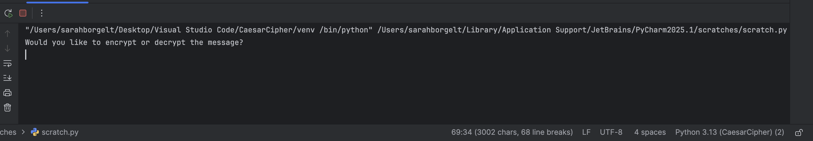
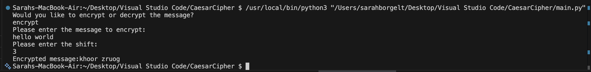
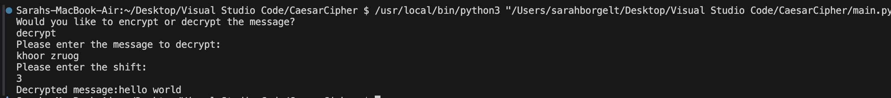

# Caesar Cipher Python Script

This command-line interface (CLI) project is a Python implementation of the classic **Caesar Cipher** encryption and decryption algorithm. It started as a FreeCodeCamp project and was later expanded by me as a way to learn Python through hands-on projects, as well as to explore Python concepts such as functions, input validation, string manipulation, and error handling.



---

## Table of Contents
- [About](#about)
- [Features](#features)
- [How to Use](#how-to-use)
- [Examples](#examples)
- [Getting Started](#getting-started)

---

## About

The Caesar Cipher is a simple substitution cipher where each letter in the plaintext is shifted a certain number of places down or up the alphabet. This Python program allows users to encrypt and decrypt messages interactively via the terminal.

This version was extended from the original FreeCodeCamp project to include:
- Clear, user-friendly prompts and error messages.
- Accept user inputs as variables
- Validate user inputs to ensure that they are useable

---

## Features

- Encrypt a message using a shift of 1–25
- Decrypt a message using the same shift
- Handles uppercase and lowercase letters
- Validates user input for both message and shift
- Prevents invalid entries and provides informative feedback

---

## How to Use

1. Run the script in your terminal:
```bash
     python3 caesar_cipher.py
```

2. When prompted, type whether you want to encrypt or decrypt.

3. Enter the message you want to process.

4. Enter the shift value (an integer between 1 and 25).

The program will output the encrypted or decrypted message.

## Examples

### Encryption Example:

Would you like to encrypt or decrypt the message?
```bash
encrypt
```
Please enter the message to encrypt:
```bash 
hello world
```
Please enter the shift:
```bash 
3
```

**Encrypted message:** khoor zruog




### Decryption Example:

Would you like to encrypt or decrypt the message?
```bash
decrypt
```

Please enter the message to decrypt:
``` bash
khoor zruog
```
Please enter the shift:
```bash
3
```
**Decrypted message:** hello world


## Getting Started

1. Clone this repository:

```bash 
git clone https://github.com/yourusername/CaesarCipher.git
```

2. Navigate to the project folder:
```bash
cd CaesarCipher
```

3. Run the script using Python 3:
```bash
python3 caesar_cipher.py
```

